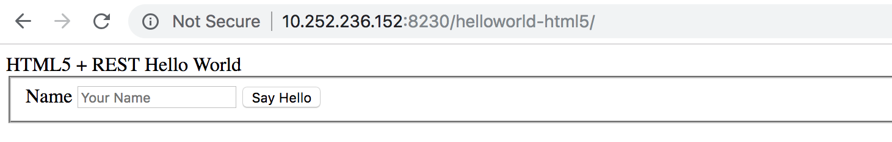

This requires 3 vms.

- 1 vm is for master. here we run the host-master: Ip address 10.252.236.150
- 2 vms for slaves: ip addresses 

  - 10.252.236.151
  - 10.252.236.152

# Steps:

0. Install ansible and git in master vm:

```
yum install -y ansible git
```

1. Create jboss accounts on each machine. As root:

```
adduser jboss
passwd jboss
```

set the password for jboss

2. In the master vm, su to jboss and generate ssh keys

```
su - jboss
ssh-keygen
```

3. Copy the keys to the other machines:  

```
ssh-copy-id -i  ~/.ssh/id_rsa jboss@10.252.236.151
ssh-copy-id -i  ~/.ssh/id_rsa jboss@10.252.236.152
```
4. Make sure you can now ssh to those machines without any password:

```
ssh jboss@10.252.236.151
ssh jboss@10.252.236.152
```

5. In the master vm, su to jboss

```
su - jboss
cd .ssh
cp id_rsa.pub authorized_keys
chmod 600 authorized_keys
```

Make sure you can log in to the master without a password.

```
ssh jboss@10.252.236.150
```

6. Clone the repository:

```
git clone https://github.com/corpbob/jboss-domain-ansible-installer.git
```

7. cd jboss-domain-ansible-installer
8. Download the jboss-eap-7.1.0.zip and place it inside the jboss-domain-ansible-installer directory
9. Run the ansible playbook

```
ansible-playbook -i hosts jboss.yaml
```

10. Upload the file helloworld-html5.war to the master node to /home/jboss

11. In the master node, connect to admin using jboss-cli

```
cd jboss-eap-7.1/bin
./jboss-cli.sh -c controller=10.252.236.150 --timeout=60000
```

12. When connected, run the command

``` 
deploy /home/jboss/helloworld-html5.war --server-groups=sit-group
```

13. Open your browser and navigate to 

- http://10.252.236.151:8080/helloworld-html5/
- http://10.252.236.152:8080/helloworld-html5/
- http://10.252.236.151:8230/helloworld-html5/
- http://10.252.236.152:8230/helloworld-html5/

All should look like:



# This is what the script does

This is what the script does if you dig into it:

1. Upload jboss binary
2. Create admin user and get the secret
3. create the domains directory for each server
4. set the name of the server in each host-slave.xml
   set the secret in host-slave.xml
5. start jboss host-master
6. start jboss host-slave in parallel
7. Execute commands below

## JBoss commands

1. Create new server groups called prod-group, uat-group, sit-group

```
/server-group=prod-group:add(profile=full,socket-binding-group=full-sockets)
/server-group=prod-group/jvm=default:add
/server-group=prod-group/jvm=default:write-attribute(name=heap-size,value="1024m")
/server-group=prod-group/jvm=default:write-attribute(name=max-heap-size,value="1024m")

/server-group=uat-group:add(profile=full-ha,socket-binding-group=full-ha-sockets)
/server-group=uat-group/jvm=default:add
/server-group=uat-group/jvm=default:write-attribute(name=heap-size,value="1024m")
/server-group=uat-group/jvm=default:write-attribute(name=max-heap-size,value="1024m")

/server-group=sit-group:add(profile=full-ha,socket-binding-group=full-ha-sockets)
/server-group=sit-group/jvm=default:add
/server-group=sit-group/jvm=default:write-attribute(name=heap-size,value="1024m")
/server-group=sit-group/jvm=default:write-attribute(name=max-heap-size,value="1024m")
```

2. Stop the out-of-the-box servers

```
/host=sit/server-config=server-one:stop
/host=sit/server-config=server-one:remove
/host=sit/server-config=server-two:stop
/host=sit/server-config=server-two:remove
```

3. Remove the out-of-the-box servers

```
/server-group=main-server-group:remove
/server-group=other-server-group:remove
```

4. Create servers for the sit-group

```
/host=sit/server-config=server11:add(group=sit-group)
/host=sit2/server-config=server12:add(group=sit-group)
```
5. Start the new servers.

```
/host=sit/server-config=server11:start
/host=sit2/server-config=server12:start
```

